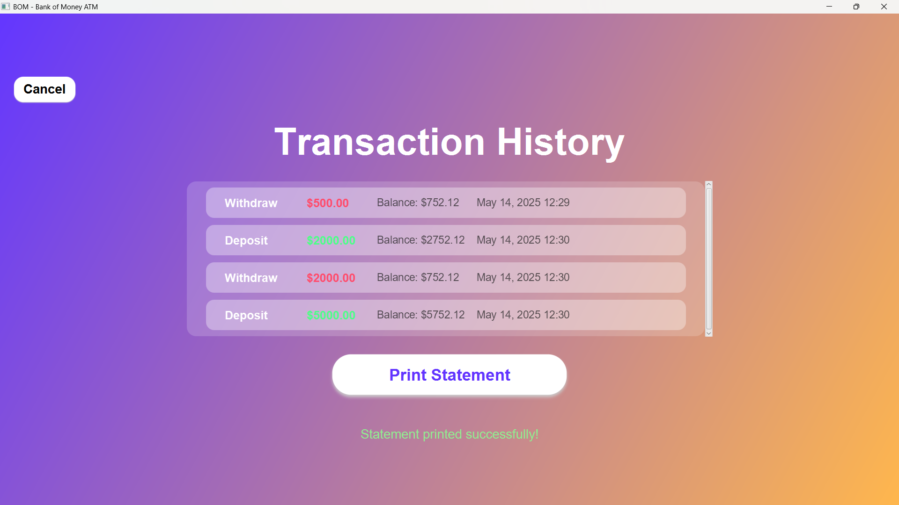

# 🏦 Java ATM Simulator – SBI Themed
## (BANK OF MONEY - BOM)

A realistic ATM simulator built in Java with a GUI that mimics the interface of an actual ATM machine. Includes PIN authentication, cash withdrawal, deposit, and balance checking — all styled with a modern SBI-themed UI and icons.


---

## ✨ Features

- 🔐 **PIN Verification** – Default user with secure login (e.g., `PIN: 1234`)
- 💰 **Withdraw & Deposit** – Real-time balance updates
- 📊 **Balance Inquiry** – Check account balance instantly
- 🧾 **Transaction Confirmation** – Clear success messages
- 🎨 **Modern UI** – Gradient backgrounds, icon buttons, and branding
- 🖥️ **Smooth Flow** – From card insertion → PIN → menu → transaction

---

## 📦 Technologies Used

- **Java (JDK 8+)**
- **JavaFX** for GUI

---

## 🚀 Getting Started

### 🔧 Requirements

- Java JDK 8 or higher
- Any IDE (IntelliJ, Eclipse, VSCode) or CLI

### 🛠️ Run Instructions

1. Clone the repository:
```bash
git clone https://github.com/Gauravbhati2099/ModernATM.git
cd ModernATM
```
2. Open the project in your IDE.

3. Make sure you have installed and added JavaFx to your env variables.

4. Compile with Javac:
  ```bash
  javac --module-path "C:\javafx-sdk-24.0.1\lib" --add-modules javafx.controls,javafx.fxml ModernATM\*.java
  ```

5. Run using Java:
  ```bash
  java --module-path "C:\javafx-sdk-24.0.1\lib" --add-modules javafx.controls,javafx.fxml -cp . ModernATM.ATMSimulatorFX
  ```

*Insert card → Enter 1234 as PIN → Explore all features!*

---


## 📸 Screenshots 

### **Welcome Screen**:


### **PIN Entry**:


### **Main Menu**:


### **Statement**:




---


## **🧠 Learning Goals**


- Understand GUI programming with Java Swing

- Simulate user authentication & session flow

- Build a real-world inspired application from scratch

---


## **✅ TODO / Future Enhancements** :

- 🧾 Add receipt generation (print or save)

- 🕓 Session timeout after inactivity

- 📜 Maintain transaction history log

- 🎵 Add sound effects (beep, cash dispense)

- 🌐 Add language/localization support

---

## **🤝 Contributing**


- Pull requests are welcome. For major changes, please open an issue first to discuss what you'd like to change.

---


## **📃 License**
- This project is open-source and available under the MIT License.

---

## **🙋‍♂️ Author**


 Gaurav Singh Bhati

📧 [Gauravbhati2099](www.linkedin.com/in/gauravbhati2099) (Linkdn)

🎓 3rd Year CSE, Geetanjali Institute of Technical Studies

---
